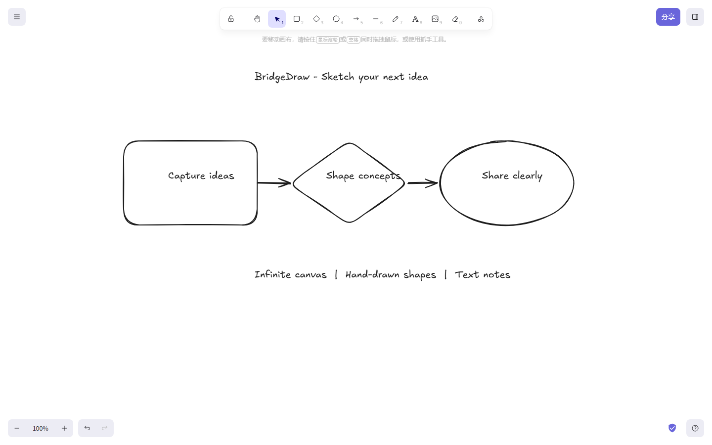

# BridgeDraw

一款基于 Excalidraw 打造的手绘风无限白板，用来快速记录灵感、绘制草图和整理想法。

BridgeDraw 保留了 Excalidraw 成熟的画布交互，并加入绿色品牌视觉、中文界面文案和更精简的产品入口。项目当前聚焦于无限画布、基础图形、文本标注与分享体验。



## 功能

- 无限画布：支持自由平移、缩放和大范围内容组织。
- 手绘图形：支持矩形、菱形、椭圆、箭头、线条和自由书写。
- 文本标注：可以在画布上添加文本，组合成说明、标签或灵感贴纸。
- 编辑能力：支持选择、移动、缩放、复制、撤销、重做和图层调整。
- 文件导入导出：支持 `.excalidraw` 文件以及 PNG、SVG 等图片格式。
- 深色模式与响应式界面：适配桌面端和移动端浏览器。
- 分享入口：保留只读链接与实时协作界面，服务限制见下方“已知限制”。

## 技术栈

- React 19
- TypeScript
- Vite 5
- Yarn Workspaces
- Rough.js
- perfect-freehand
- Jotai

## 本地启动

### 环境要求

- Node.js 18 或更高版本
- Yarn 1.22.22
- Git

### 安装与运行

```bash
git clone https://github.com/wygggw/BridgeDraw.git
cd BridgeDraw
yarn install
yarn start
```

开发服务器启动后，打开 [http://localhost:3000](http://localhost:3000)。

Windows PowerShell 如果因执行策略无法运行 `yarn.ps1`，请改用：

```powershell
yarn.cmd install
yarn.cmd start
```

### 常用命令

```bash
yarn start          # 启动开发服务器
yarn build          # 构建生产版本
yarn test           # 运行测试
yarn test:typecheck # TypeScript 类型检查
yarn fix            # 格式化并修复代码风格
```

### Docker

不希望在本机配置 Node.js 时，可以使用 Docker Compose：

```bash
docker compose up --build -d
```

## 已知限制

- Excalidraw 官方目前没有为自托管版本提供完整的分享和实时协作后端。
- 本地开发环境的只读分享会访问 Excalidraw 外部 JSON 服务；该服务不可用时，链接创建会失败。
- 实时协作需要额外部署兼容的协作服务器和文件存储服务。
- 当前 BridgeDraw 定制版每次打开时从空白画布开始，不恢复上一次保存在浏览器中的画布元素。

无限画布、图形、文本、文件导出等核心编辑功能不依赖 API Key、数据库或 Docker。

## 与 Excalidraw 的关系

BridgeDraw 基于开源项目 [Excalidraw](https://github.com/excalidraw/excalidraw) 修改，保留其核心编辑器、文件格式和主要交互能力。

本仓库不是 Excalidraw 官方产品，也不代表 Excalidraw 团队。BridgeDraw 的品牌、界面调整和后续功能由本仓库维护者独立维护。

仓库保留两个 Git 远程：

- `origin`：BridgeDraw 项目仓库。
- `upstream`：Excalidraw 官方仓库。

同步上游更新时可以执行：

```bash
git fetch upstream
git merge upstream/master
```

合并前建议新建分支，并检查上游改动是否与 BridgeDraw 的品牌定制冲突。

## 开源许可

本项目沿用 Excalidraw 的 [MIT License](LICENSE)。

原始项目版权声明：

```text
Copyright (c) 2020 Excalidraw
```

使用、复制、修改或分发本项目时，请保留原始版权声明和 MIT 许可文本。感谢 Excalidraw 团队及所有贡献者提供的优秀开源基础。
